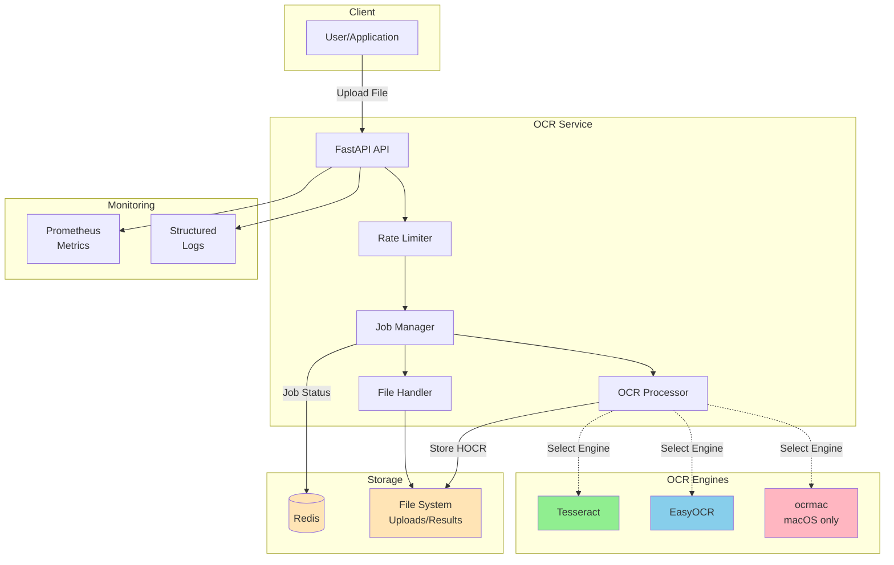

# RESTful OCR API

[](https://www.gnu.org/licenses/gpl-3.0)
[](https://www.python.org/downloads/)
[](https://github.com/OCRBridge/ocr-service/actions/workflows/ci.yml)
[](https://github.com/OCRBridge/ocr-service/actions/workflows/docker-publish.yml)
[](https://codecov.io/gh/OCRBridge/ocr-service)
[](https://github.com/astral-sh/ruff)
[](https://github.com/microsoft/pyright)
[](https://hub.docker.com/)
[](https://github.com/OCRBridge/ocr-service/actions/workflows/tests.yml)
[](https://github.com/OCRBridge/ocr-service/actions/workflows/ci.yml)

A high-performance RESTful API service for document OCR processing with HOCR (HTML-based OCR) output format.

## Features

- **Multi-format Support**: Process JPEG, PNG, PDF, and TIFF documents
- **HOCR Output**: Industry-standard HTML-based OCR with bounding boxes and text hierarchy
- **Async Processing**: Job-based async processing with status polling
- **Rate Limiting**: 100 requests/minute per IP address
- **Auto-expiration**: Results auto-delete after 48 hours
- **No Authentication**: Public API for easy integration
- **High Performance**: <30s processing time for typical documents

## Architecture



### Request Flow

1. **Upload**: Client sends document via HTTP POST
2. **Validation**: File type, size, and format validation
3. **Rate Limiting**: Check IP-based rate limits (100 req/min)
4. **Job Creation**: Generate unique job ID, store in Redis
5. **Processing**: Convert to image(s), run OCR engine, generate HOCR
6. **Storage**: Save HOCR result to filesystem with 48h TTL
7. **Polling**: Client checks status via job ID
8. **Download**: Client retrieves HOCR result when complete

## Quick Start

### Using Pre-built Docker Images

Pre-built Docker images are automatically published to GitHub Container Registry and Docker Hub on every release:

**GitHub Container Registry (GHCR):**
```bash
docker pull ghcr.io/ocrbridge/ocr-service:latest
```

**Docker Hub:**
```bash
docker pull datenzar/restful-ocr:latest
```

Available tags:
- `latest` - Latest stable release from main branch
- `v1.1.0` - Specific version tags
- `1.1` - Major.minor version
- `1` - Major version

**Quick run with Docker:**
```bash
# Pull and run (requires Redis)
docker run -d --name redis redis:7-alpine
docker run -d -p 8000:8000 \
  -e REDIS_URL=redis://redis:6379/0 \
  --link redis:redis \
  ghcr.io/ocrbridge/ocr-service:latest
```

### Running with Docker Compose (Recommended)

**Option 1: Production (pre-built image):**
```bash
# Uses pre-built image from GHCR
docker compose -f docker-compose.prod.yml up -d

# View logs
docker compose -f docker-compose.prod.yml logs -f api

# Stop services
docker compose -f docker-compose.prod.yml down
```

**Option 2: Development (local build):**
```bash
# Builds image locally from source
docker compose up -d

# View logs
docker compose logs -f api

# Stop services
docker compose down
```

The API will be available at `http://localhost:8000`. Check the health endpoint to verify:
```bash
curl http://localhost:8000/health
```

### Development Setup

For local development without Docker, or to contribute to the project, see the [Contributing Guide](CONTRIBUTING.md) for detailed setup instructions including:
- Installing dependencies (Python, Redis, Tesseract, etc.)
- Setting up your development environment
- Running tests and code quality tools

## API Documentation

FastAPI automatically generates interactive API documentation:

- **Swagger UI**: http://localhost:8000/docs - Interactive API explorer with "Try it out" functionality
- **ReDoc**: http://localhost:8000/redoc - Alternative documentation with a cleaner layout
- **OpenAPI Schema**: http://localhost:8000/openapi.json - Machine-readable API specification

The interactive documentation allows you to test all endpoints directly from your browser without using curl or Postman.

## API Usage

### 1. Upload Document

```bash
curl -X POST http://localhost:8000/upload \
  -F "file=@samples/numbers_gs150.jpg"
```

Response:
```json
{
  "job_id": "Kj4TY2vN8xQz9wR5pL7mH3fC1sD6aB8nE0gU4tV2iX1",
  "status": "pending",
  "message": "Upload successful, processing started"
}
```

### 2. Check Status

```bash
curl -X GET "http://localhost:8000/jobs/{job_id}/status"
```

Response:
```json
{
  "job_id": "Kj4TY...",
  "status": "completed",
  "upload_time": "2025-10-18T10:00:00Z",
  "start_time": "2025-10-18T10:00:05Z",
  "completion_time": "2025-10-18T10:00:12Z",
  "expiration_time": "2025-10-20T10:00:12Z",
  "error_message": null,
  "error_code": null
}
```

### 3. Download HOCR Result

```bash
curl -X GET "http://localhost:8000/jobs/{job_id}/result" -o result.hocr
```

### 4. Health Check

```bash
curl -X GET http://localhost:8000/health
```

### 5. Metrics (Prometheus)

```bash
curl -X GET http://localhost:8000/metrics
```

## Configuration

All configuration is via environment variables (see `.env.example`):

- `REDIS_URL`: Redis connection string
- `UPLOAD_DIR`: Temporary upload directory
- `RESULTS_DIR`: HOCR results directory
- `MAX_UPLOAD_SIZE_MB`: Maximum file size (default: 25MB)
- `RATE_LIMIT_REQUESTS`: Requests per minute per IP (default: 100)
- `JOB_EXPIRATION_HOURS`: Auto-delete results after (default: 48)
- `TESSERACT_LANG`: OCR language (default: eng)

## Performance

- **OCR Processing**: <30 seconds for single-page documents <5MB
- **Status Endpoint**: <800ms p95 latency
- **Result Endpoint**: <800ms p95 latency
- **Throughput**: 100 requests/min per IP
- **Concurrency**: 10+ simultaneous users
- **Memory**: <512MB per request

## Architecture

- **Web Framework**: FastAPI with async/await
- **OCR Engine**: Tesseract 5.3+ via pytesseract
- **Job Store**: Redis with 48h TTL
- **PDF Processing**: pdf2image (poppler wrapper)
- **Rate Limiting**: slowapi with Redis backend
- **Logging**: structlog (JSON format)
- **Metrics**: Prometheus client

## Platform Notes

### macOS OCR Engine

This API includes support for macOS's native Vision and LiveText OCR frameworks when running natively on macOS. However, these features are **not available in Docker containers** due to macOS framework limitations.

- When running in Docker (recommended): Tesseract and EasyOCR engines are available
- When running natively on macOS: All engines including ocrmac (Vision/LiveText) are available

See [CONTRIBUTING.md](CONTRIBUTING.md) for more details on platform-specific limitations.

## Deployment

For comprehensive deployment instructions, see **[DEPLOYMENT.md](DEPLOYMENT.md)** which covers:

- 🐳 **Docker Image Publishing** - Pre-built images on GHCR and Docker Hub
- ☁️ **Cloud Platforms** - Deploy to Railway, Render, Fly.io, AWS, GCP, Azure
- ⚙️ **Kubernetes** - Complete K8s manifests and scaling strategies
- 📊 **Monitoring** - Prometheus metrics and health checks
- 🔒 **Security** - Production hardening checklist
- 🔄 **Updates & Rollbacks** - Version management strategies
- 💾 **Backup & Recovery** - Data persistence and disaster recovery

### Quick Production Deploy

Using pre-built Docker images:

```bash
# Pull latest image
docker pull ghcr.io/ocrbridge/ocr-service:latest

# Run with Docker Compose
docker compose -f docker-compose.prod.yml up -d

# Check health
curl http://localhost:8000/health
```

### Resource Requirements

**Minimum per instance:**
- CPU: 1 core (2+ recommended)
- Memory: 2GB RAM (4GB+ recommended)
- Storage: 10GB for temp files + results
- Redis: 512MB RAM minimum

## Contributing

Interested in contributing? Check out our [CONTRIBUTING.md](CONTRIBUTING.md) for guidelines on:
- Setting up your development environment
- Running tests and code quality checks
- Following our Test-Driven Development workflow
- Submitting bug fixes and features

## License

This project is licensed under the GNU General Public License v3.0 - see the [LICENSE](LICENSE) file for details.
