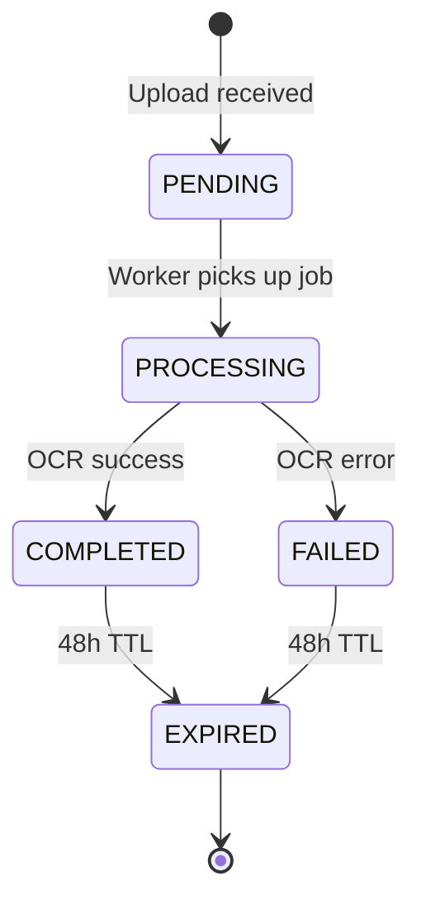

# Data Model

**Feature**: OCR Document Upload with HOCR Output
**Date**: 2025-10-18
**Status**: Phase 1 Design

## Overview

This document defines the data entities, their attributes, relationships, validation rules, and state transitions for the OCR document processing system. All models use Pydantic for runtime type validation and schema generation.

## Entity Definitions

### 1. DocumentUpload

**Purpose**: Represents a file submitted by a user for OCR processing

**Attributes**:

| Attribute | Type | Constraints | Description |
|-----------|------|-------------|-------------|
| `file_name` | `str` | Required, max 255 chars | Original filename from upload |
| `file_format` | `FileFormat` (enum) | Required, one of: JPEG, PNG, PDF, TIFF | Detected MIME type |
| `file_size` | `int` | Required, >0, <=25MB (26214400 bytes) | Size in bytes |
| `content_type` | `str` | Required | HTTP Content-Type header value |
| `upload_timestamp` | `datetime` | Required, auto-generated (UTC) | When file was received |
| `temp_file_path` | `Path` | Required, must exist | Temporary storage location |

**Validation Rules**:
- File size MUST NOT exceed 25MB (FR-007)
- File format MUST match magic bytes and extension (FR-006)
- Temp file path MUST be within allowed temp directory (security)
- File name MUST be sanitized (no path traversal characters)

**Pydantic Model**:
```python
from enum import Enum
from pathlib import Path
from datetime import datetime
from pydantic import BaseModel, Field, field_validator

class FileFormat(str, Enum):
    JPEG = "image/jpeg"
    PNG = "image/png"
    PDF = "application/pdf"
    TIFF = "image/tiff"

class DocumentUpload(BaseModel):
    file_name: str = Field(..., max_length=255)
    file_format: FileFormat
    file_size: int = Field(..., gt=0, le=26214400)  # 25MB
    content_type: str
    upload_timestamp: datetime = Field(default_factory=lambda: datetime.utcnow())
    temp_file_path: Path

    @field_validator('file_name')
    @classmethod
    def sanitize_filename(cls, v: str) -> str:
        # Remove path traversal attempts
        return Path(v).name

    @field_validator('temp_file_path')
    @classmethod
    def validate_temp_path(cls, v: Path) -> Path:
        # Ensure path is within temp directory
        if not str(v).startswith('/tmp/uploads/'):
            raise ValueError("Invalid temp file path")
        return v
```

**Relationships**:
- One-to-one with `OCRJob` (each upload creates exactly one job)

---

### 2. OCRJob

**Purpose**: Represents a processing task for a document with lifecycle tracking

**Attributes**:

| Attribute | Type | Constraints | Description |
|-----------|------|-------------|-------------|
| `job_id` | `str` | Required, unique, 43 chars | Cryptographically secure token |
| `status` | `JobStatus` (enum) | Required, default: PENDING | Current processing state |
| `upload` | `DocumentUpload` | Required | Associated upload metadata |
| `start_time` | `datetime` \| `None` | Optional, set when processing begins | When OCR started |
| `completion_time` | `datetime` \| `None` | Optional, set when done (success/fail) | When processing finished |
| `expiration_time` | `datetime` | Required, auto-calculated (completion + 48h) | When results auto-delete |
| `error_message` | `str` \| `None` | Optional, max 500 chars | Error details if status=FAILED |
| `error_code` | `ErrorCode` (enum) \| `None` | Optional | Machine-readable error type |

**Validation Rules**:
- `job_id` MUST be generated via `secrets.token_urlsafe(32)` (FR-016)
- `expiration_time` MUST be 48 hours after `completion_time` (FR-012)
- `start_time` MUST be after `upload.upload_timestamp`
- `completion_time` MUST be after `start_time` (if both present)
- `error_message` and `error_code` MUST be set if `status == FAILED`
- `error_message` and `error_code` MUST be None if `status != FAILED`

**State Transitions**:



**Pydantic Model**:
```python
from enum import Enum
from datetime import datetime, timedelta
import secrets

class JobStatus(str, Enum):
    PENDING = "pending"
    PROCESSING = "processing"
    COMPLETED = "completed"
    FAILED = "failed"

class ErrorCode(str, Enum):
    INVALID_FORMAT = "invalid_format"
    CORRUPTED_FILE = "corrupted_file"
    OCR_ENGINE_ERROR = "ocr_engine_error"
    TIMEOUT = "timeout"
    MEMORY_LIMIT = "memory_limit"
    INTERNAL_ERROR = "internal_error"

class OCRJob(BaseModel):
    job_id: str = Field(default_factory=lambda: secrets.token_urlsafe(32))
    status: JobStatus = JobStatus.PENDING
    upload: DocumentUpload
    start_time: datetime | None = None
    completion_time: datetime | None = None
    expiration_time: datetime | None = None
    error_message: str | None = Field(None, max_length=500)
    error_code: ErrorCode | None = None

    @field_validator('expiration_time', mode='before')
    @classmethod
    def calculate_expiration(cls, v, info):
        if v is None and info.data.get('completion_time'):
            return info.data['completion_time'] + timedelta(hours=48)
        return v

    def mark_processing(self):
        """Transition to PROCESSING state"""
        if self.status != JobStatus.PENDING:
            raise ValueError(f"Cannot start processing from {self.status} state")
        self.status = JobStatus.PROCESSING
        self.start_time = datetime.utcnow()

    def mark_completed(self):
        """Transition to COMPLETED state"""
        if self.status != JobStatus.PROCESSING:
            raise ValueError(f"Cannot complete from {self.status} state")
        self.status = JobStatus.COMPLETED
        self.completion_time = datetime.utcnow()
        self.expiration_time = self.completion_time + timedelta(hours=48)

    def mark_failed(self, error_code: ErrorCode, error_message: str):
        """Transition to FAILED state"""
        if self.status not in [JobStatus.PENDING, JobStatus.PROCESSING]:
            raise ValueError(f"Cannot fail from {self.status} state")
        self.status = JobStatus.FAILED
        self.completion_time = datetime.utcnow()
        self.expiration_time = self.completion_time + timedelta(hours=48)
        self.error_code = error_code
        self.error_message = error_message[:500]  # Truncate if too long
```

**Relationships**:
- One-to-one with `DocumentUpload`
- One-to-one with `HOCRResult` (if status == COMPLETED)

---

### 3. HOCRResult

**Purpose**: Represents the output of OCR processing in HOCR format

**Attributes**:

| Attribute | Type | Constraints | Description |
|-----------|------|-------------|-------------|
| `job_id` | `str` | Required, foreign key to OCRJob | Associated job |
| `hocr_content` | `str` | Required, valid XML | Full HOCR-formatted output |
| `file_path` | `Path` | Required, must exist | Path to .hocr file on disk |
| `file_size` | `int` | Required, >0 | HOCR file size in bytes |
| `page_count` | `int` | Required, >=1 | Number of pages processed |
| `word_count` | `int` | Required, >=0 | Total words extracted |
| `confidence_avg` | `float` \| `None` | Optional, 0.0-1.0 | Average OCR confidence score |
| `creation_time` | `datetime` | Required, auto-generated (UTC) | When HOCR was generated |
| `expiration_time` | `datetime` | Required, same as job.expiration_time | When file auto-deletes |

**Validation Rules**:
- `hocr_content` MUST be valid XML conforming to HOCR spec (FR-004)
- `hocr_content` MUST include bounding box coordinates (FR-005)
- `hocr_content` MUST preserve text hierarchy: pages → paragraphs → lines → words (FR-010)
- `page_count` MUST match number of `<div class="ocr_page">` elements
- `file_path` MUST be within results directory
- `expiration_time` MUST match associated job's expiration

**Pydantic Model**:
```python
import xml.etree.ElementTree as ET
from pathlib import Path

class HOCRResult(BaseModel):
    job_id: str
    hocr_content: str
    file_path: Path
    file_size: int = Field(..., gt=0)
    page_count: int = Field(..., ge=1)
    word_count: int = Field(..., ge=0)
    confidence_avg: float | None = Field(None, ge=0.0, le=1.0)
    creation_time: datetime = Field(default_factory=lambda: datetime.utcnow())
    expiration_time: datetime

    @field_validator('hocr_content')
    @classmethod
    def validate_hocr_xml(cls, v: str) -> str:
        try:
            root = ET.fromstring(v)
            # Check for HOCR namespace/class markers
            if not (root.tag == 'html' or 'ocr_page' in v):
                raise ValueError("Not a valid HOCR document")
            return v
        except ET.ParseError as e:
            raise ValueError(f"Invalid XML: {e}")

    @field_validator('file_path')
    @classmethod
    def validate_result_path(cls, v: Path) -> Path:
        if not str(v).startswith('/tmp/results/'):
            raise ValueError("Invalid result file path")
        return v

    @property
    def has_bounding_boxes(self) -> bool:
        """Check if HOCR contains bbox coordinates (FR-005)"""
        return 'bbox' in self.hocr_content
```

**Relationships**:
- One-to-one with `OCRJob` (each completed job has exactly one result)

---

### 4. RateLimitEntry

**Purpose**: Tracks API request counts per IP address for rate limiting

**Attributes**:

| Attribute | Type | Constraints | Description |
|-----------|------|-------------|-------------|
| `ip_address` | `IPv4Address` \| `IPv6Address` | Required | Client IP (from X-Forwarded-For or direct) |
| `window_start` | `datetime` | Required | Start of current 1-minute window |
| `request_count` | `int` | Required, >=0, <=100 | Requests in current window |

**Validation Rules**:
- `request_count` MUST NOT exceed 100 (FR-015)
- Window resets every 60 seconds
- Stored in Redis with TTL of 60 seconds

**Pydantic Model**:
```python
from ipaddress import IPv4Address, IPv6Address

class RateLimitEntry(BaseModel):
    ip_address: IPv4Address | IPv6Address
    window_start: datetime
    request_count: int = Field(..., ge=0, le=100)

    def is_rate_limited(self) -> bool:
        """Check if IP has exceeded rate limit"""
        window_age = (datetime.utcnow() - self.window_start).total_seconds()
        if window_age > 60:
            # Window expired, reset
            return False
        return self.request_count >= 100
```

**Storage**:
- Redis key: `ratelimit:{ip}:{minute_timestamp}`
- Redis value: `request_count`
- Redis TTL: 60 seconds

---

## Supporting Types

### API Request/Response Models

#### Upload Request
```python
from fastapi import UploadFile, File

# Multipart form data - not a Pydantic model
# Handled via FastAPI UploadFile directly
```

#### Upload Response
```python
class UploadResponse(BaseModel):
    job_id: str
    status: JobStatus
    message: str = "Upload successful, processing started"

    model_config = {
        "json_schema_extra": {
            "example": {
                "job_id": "Kj4TY2vN8xQz9wR5pL7mH3fC1sD6aB8nE0gU4tV2iX1",
                "status": "pending",
                "message": "Upload successful, processing started"
            }
        }
    }
```

#### Status Response
```python
class StatusResponse(BaseModel):
    job_id: str
    status: JobStatus
    upload_time: datetime
    start_time: datetime | None = None
    completion_time: datetime | None = None
    expiration_time: datetime | None = None
    error_message: str | None = None
    error_code: ErrorCode | None = None

    model_config = {
        "json_schema_extra": {
            "example": {
                "job_id": "Kj4TY...",
                "status": "completed",
                "upload_time": "2025-10-18T10:00:00Z",
                "start_time": "2025-10-18T10:00:05Z",
                "completion_time": "2025-10-18T10:00:12Z",
                "expiration_time": "2025-10-20T10:00:12Z",
                "error_message": None,
                "error_code": None
            }
        }
    }
```

#### Retrieval Response
```python
# Direct file download via FastAPI Response with content-type: text/html
# No Pydantic model needed - streams file content
```

#### Error Response
```python
class ErrorResponse(BaseModel):
    detail: str
    error_code: str | None = None
    timestamp: datetime = Field(default_factory=lambda: datetime.utcnow())

    model_config = {
        "json_schema_extra": {
            "example": {
                "detail": "Unsupported file format. Supported formats: JPEG, PNG, PDF, TIFF",
                "error_code": "invalid_format",
                "timestamp": "2025-10-18T10:00:00Z"
            }
        }
    }
```

---

## Data Persistence Strategy

### Redis Schema

#### Job Metadata
```
Key: job:{job_id}:metadata
Type: Hash
Fields:
  - status: "pending"|"processing"|"completed"|"failed"
  - upload_time: ISO 8601 timestamp
  - start_time: ISO 8601 timestamp (nullable)
  - completion_time: ISO 8601 timestamp (nullable)
  - expiration_time: ISO 8601 timestamp
  - file_name: string
  - file_format: string
  - file_size: integer
  - error_message: string (nullable)
  - error_code: string (nullable)
TTL: 48 hours (set on completion)
```

#### Result Path
```
Key: job:{job_id}:result
Type: String
Value: "/tmp/results/{job_id}.hocr"
TTL: 48 hours (same as metadata)
```

#### Rate Limiting
```
Key: ratelimit:{ip}:{minute_epoch}
Type: Integer
Value: request_count
TTL: 60 seconds
```

### File System

#### Temp Uploads
```
Path: /tmp/uploads/{uuid}.{ext}
Lifecycle: Delete after processing completes (success or failure)
Permissions: 600 (owner read/write only)
```

#### Result Files
```
Path: /tmp/results/{job_id}.hocr
Lifecycle: Delete after 48 hours (Redis TTL + background cleanup task)
Permissions: 600 (owner read/write only)
```

---

## Validation Summary

### Input Validation (FR-006, FR-007)

| Input | Validation | Error Response |
|-------|------------|----------------|
| File format | Magic bytes match (JPEG/PNG/PDF/TIFF) | HTTP 415 + JSON error |
| File size | <= 25MB (26214400 bytes) | HTTP 413 + JSON error |
| Content-Type | Matches file format | HTTP 400 + JSON error |
| Job ID (retrieval) | 43-char token_urlsafe format | HTTP 404 + JSON error |
| Rate limit | <= 100 requests/min per IP | HTTP 429 + Retry-After header |

### Output Validation (FR-004, FR-005, FR-010)

| Output | Validation | Failure Action |
|--------|------------|----------------|
| HOCR XML | Well-formed XML | Mark job as FAILED with error_code |
| Bounding boxes | bbox attributes present | Mark job as FAILED |
| Text hierarchy | <div ocr_page> → <p> → <span ocr_line> → <span ocrx_word> | Mark job as FAILED |
| File size | >0 bytes | Mark job as FAILED |

---

## Indexing & Query Patterns

### Redis Queries

```python
# Create job
HSET job:{job_id}:metadata status "pending" upload_time {iso_time} ...
EXPIRE job:{job_id}:metadata 172800  # 48 hours

# Get job status
HGETALL job:{job_id}:metadata

# Update job status
HSET job:{job_id}:metadata status "processing" start_time {iso_time}

# Check rate limit
INCR ratelimit:{ip}:{minute}
EXPIRE ratelimit:{ip}:{minute} 60
```

### File System Queries

```python
# Save uploaded file
async with aiofiles.open(f"/tmp/uploads/{uuid}.{ext}", 'wb') as f:
    await f.write(content)

# Read result file
async with aiofiles.open(f"/tmp/results/{job_id}.hocr", 'r') as f:
    hocr_content = await f.read()

# Cleanup expired results
for file in Path("/tmp/results/").glob("*.hocr"):
    if file.stat().st_mtime < (time.time() - 172800):  # 48h
        file.unlink()
```

---

## Data Model Testing Strategy

### Unit Tests

1. **Pydantic Model Validation**:
   - Valid inputs pass
   - Invalid inputs raise ValidationError
   - Default values populate correctly
   - Field validators enforce constraints

2. **State Transition Logic**:
   - Job status transitions follow state machine
   - Invalid transitions raise errors
   - Timestamps auto-populate correctly

3. **Cryptographic Security**:
   - Job IDs are unique (1M generation test)
   - Job IDs are non-guessable (entropy check)

### Integration Tests

1. **Redis Persistence**:
   - Job metadata round-trips correctly
   - TTL enforcement (mock time)
   - Rate limiting counters increment atomically

2. **File System Persistence**:
   - Temp files create/delete correctly
   - Result files readable after write
   - Cleanup task removes expired files

---

## References

- Pydantic Validation: https://docs.pydantic.dev/latest/concepts/validators/
- HOCR Specification: https://github.com/kba/hocr-spec
- Redis Data Types: https://redis.io/docs/data-types/
- FastAPI Request Models: https://fastapi.tiangolo.com/tutorial/body/
